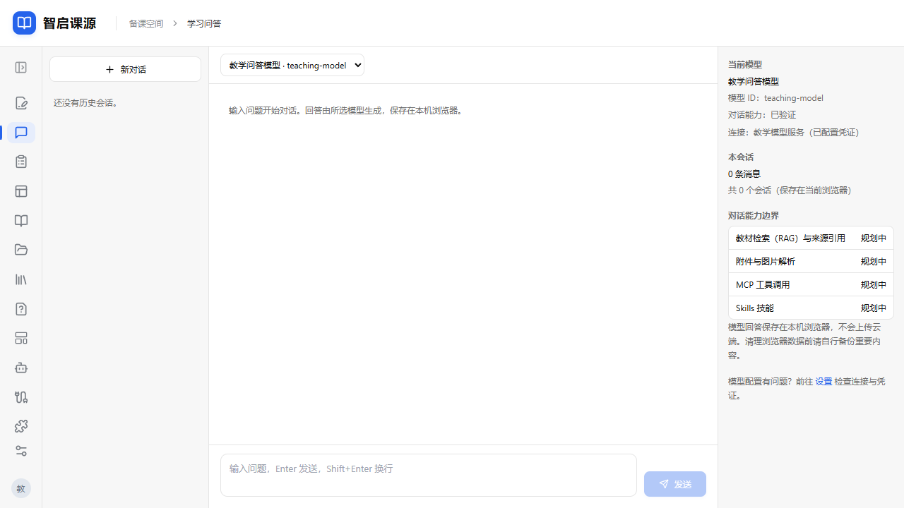
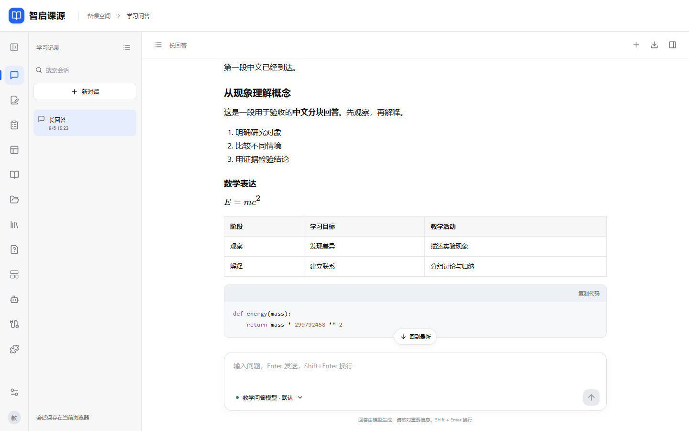
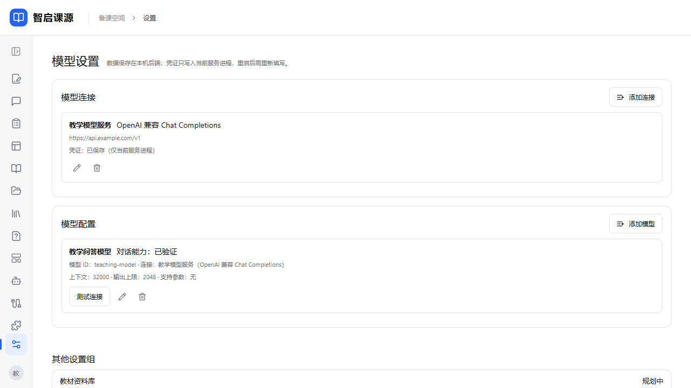
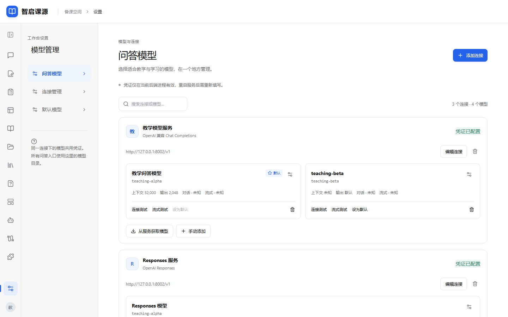
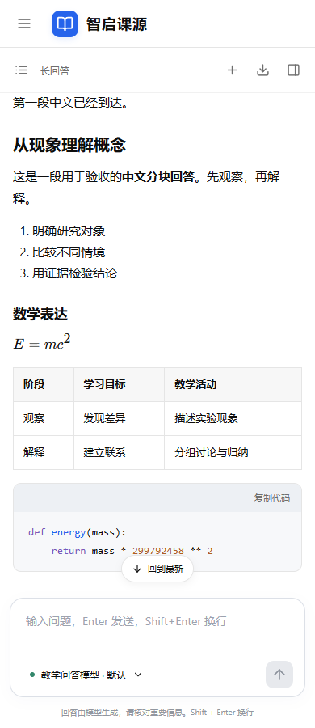
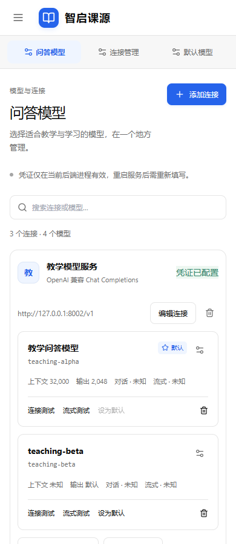

# 学习问答与模型管理：修复、验收和交接

日期：2026-09-06。工作目录：`H:\备份xuexi\智启课源`。本记录优先于旧 D04 交接中的纯文本范围、测试数量和“无阻塞问题”结论。

## Review 结论与处理

| 问题 | 处理与证据 |
| --- | --- |
| 原测试完整响应回填不能证明浏览器流式 | 新增真实 HTTP 上游 → FastAPI → Next 代理 → 浏览器门控测试：浏览器首段中文已可见时，上游末段尚未获准发送；三协议均通过 |
| 生成中新建/切换可能丢失或串写 | 请求绑定会话和消息 ID，停止使旧回调失效，保存后再导航；自动化验证晚到文本不进入新会话 |
| 重试覆盖部分答案 | 保留原尝试，标记被替代并从模型上下文排除；仅最后失败轮次可直接重试，旧轮次可复制问题 |
| IndexedDB 每个分块写入、未等待事务、无冲突保护 | 400ms 合并、串行保存、事务完成确认、revision 比较、草稿恢复；失败保留内存并提供备份 |
| 上游错误可回显敏感内容 | 返回本地错误文案，认证头集中处理，限制附加头，Base URL 不允许用户信息 |
| SSE 关闭和结束状态不完整 | 显式关闭上游上下文；处理空回答、断流、错误和截断，取消传播到实际 HTTP 连接 |
| 模型目录割裂、缺默认模型 | 原子目录接口、连接分组、统一搜索选择器、默认模型；失效会话选择不切换到另一供应商 |
| 配置能力与实测混淆 | 人工声明不能写为 verified；普通测试与流式测试分别记录；配置改变清除关联验证状态；测试期间版本变化不写回旧证据 |
| 手机正文只有半屏、页头被裁切 | 修复网格列与外壳滚动范围；新增正文宽度断言并查看实际截图 |

**实际供应商“等待后一次性输出”的根因尚未确认。** 本次没有可用的后端进程内凭证，未请求用户实际模型。已证明受控上游分块可穿过生产构建代理并及时显示，不能据此断言特定供应商已经修好。没有逐字播放完整回答来伪装流式。

## 实现范围

- 设置页：连接、问答模型、默认模型三个区域；按连接展开模型卡片，搜索、手动新增、发现多选追加、去重、编辑和删除。被引用连接禁止直接删除，凭证仅显示存在状态。
- 模型详情：模型 ID、名称、上下文、输出上限和声明支持参数的实际值。获取列表不会覆盖既有参数、名称或能力。发现失败保留手动路径。
- 表单提交锁、防重复提交、成功/失败反馈；版本冲突保留表单，重新读取版本后可继续保存。
- 学习问答：白/灰/蓝教案风格，折叠会话列表、默认收起详情、自动增高输入框、模型选择与发送/停止；Markdown、公式、代码复制、高亮、表格横向滚动、安全链接；不加载回答中的远程图片或执行 HTML。
- 阅读时离开底部停止自动跟随，提供回到最新；移动端会话与详情使用原生 dialog 焦点管理。学习问答导航第一，教案第二，首页仍跳转教案。
- 会话保存 schemaVersion、revision、草稿和选择，消息保存实际模型快照；旧记录兼容读取，未完成回答刷新后标中断。教案草稿和原 Word 未迁移或覆盖。

## 实际检查

| 命令 | 结果 |
| --- | --- |
| `npm run typecheck` | 通过 |
| `npm run lint` | 通过，0 警告 |
| `npm run test:unit` | 54 项通过；含存储失败、草稿/中断恢复、部分重试、事务和双写版本冲突 |
| `npm run build` | 通过 |
| `npm run test:api` | 78 项通过；1 条依赖弃用警告 |
| `npm run test:e2e` | 17 项通过；含导航、教案草稿、Word/PDF 回归 |
| `npm run test:chat` | 6 项通过；真实网络三协议门控流、关闭上游、模型发现追加/默认/冲突、三尺寸截图 |
| `npm run template:verify` | original/source 均 true |

隔离集成使用端口 5174/8001/8002、临时配置和独立浏览器上下文，不读取真实凭证和草稿。测试构建位于 `.next-test`，正式构建仍为 `.next`。源码入口：`tests/integration/chat-live.spec.ts`、`tests/fixtures/stream_backend.py`、`playwright.chat.config.ts`。

协议单测覆盖 UTF-8 跨块、上游错误/超时、终止与异常断流；集成测试证明最后分块发送前已渲染首段，而非仅检查字符串或构建成功。并非下述全部边界都有独立浏览器用例：实际双浏览器标签竞争由两个仓储实例事务测试覆盖；发现超时/空列表、所有触控组合尚未逐一完成浏览器交互测试。

## 前后截图

截图均使用隔离样例数据，不含真实凭证或历史。1440/1024/390px 已查看问答长正文与模型管理；空会话保存桌面截图。移动端极长公式/复杂嵌套表格仍建议真实内容复核。

| 修改前 | 修改后 |
| --- | --- |
|  |  |
|  |  |

## 参考与后续边界

交互参考固定为 DeepTutor v1.6.4（commit `93df3d48b70586c36b20ebf82c613a67ed20677f`）：[ConnectionsEditor](https://github.com/HKUDS/DeepTutor/blob/v1.6.4/web/components/settings/ConnectionsEditor.tsx)、[ModelCards](https://github.com/HKUDS/DeepTutor/blob/v1.6.4/web/components/settings/ModelCards.tsx)、[ModelListPicker](https://github.com/HKUDS/DeepTutor/blob/v1.6.4/web/components/settings/ModelListPicker.tsx)。结合现有教案风格实现，并非照搬其品牌或后端。

真实供应商下一步：启动后端，在设置重新填写凭证，分别测试普通与流式，再发送较长中文问题检查首段时机、停止和重试。若仅收到单块，记录供应商首块/末块时序进一步定位；单次普通连接成功不代表流式验证。

浏览器强制结束进程无法保证最后 400ms 未提交草稿已落盘；应用内导航等待保存，异常关闭依靠已落盘的中断恢复。凭证重启失效是既定行为。无数据库、账号、RAG、附件解析、工具调用或任务模型分配；没有提交、推送、部署。
