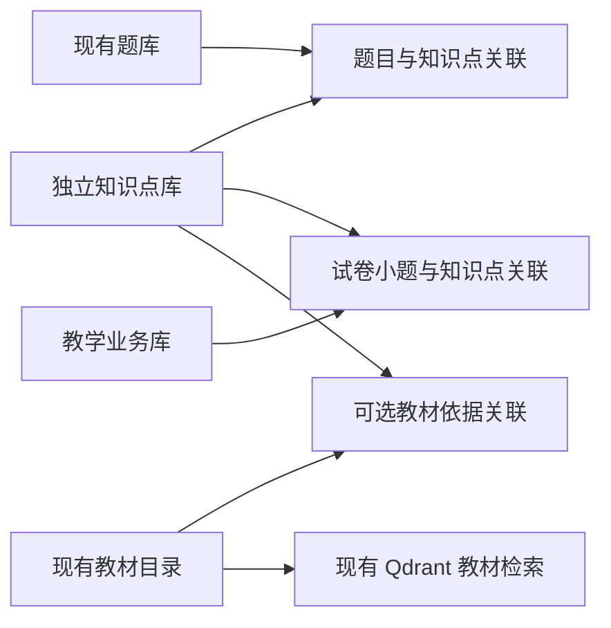
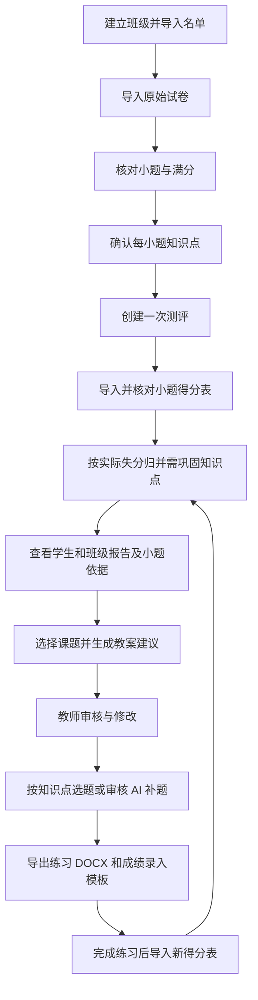

# 智启课源：学情分析、知识点题库与 AI 备课数据库设计

设计版本：v1.0；日期：2026-09-30。本文档包是功能与数据库设计规格，不代表这些模块已经实现。当前项目能力与实施进度以 `docs/CURRENT_STATUS.md` 为准。原始计划书只作为参考，本轮用户的明确意见优先。

实施与派发入口（v2.0）：[多 Agent 实施任务计划书](多Agent实施任务计划书_v2.0.md)、[总控/实现/验收启动提示词](多Agent启动提示词_v2.0.md)。用户已改为一人调度多个 Agent，原八人任务下发包保留作历史参考。新计划中的导入批次、任务及修订补齐属于待实施增量，不能把原参考 SQL 当作已完成的迁移。

## 1. 已确定的需求

1. 教师提供学生名单、原始试卷 DOCX、每位学生的每小题得分表。系统解析小题，建议其知识点，由教师确认后建立关联。
2. **任意一道关联小题实际得分低于该小题满分，就把关联知识点列入该学生本次测评的“需巩固知识点”。** 本轮用户已选定此规则。
3. 不引入掌握概率预测、知识追踪、加权掌握度或多知识点分值分摊。得分已经由教师或现有成绩系统提供，本系统不改卷、不识别评分点、不自动给学生答案打分。
4. **知识点独立建库，题库通过关联表归类到知识点。** 教材不是题目所属的必经父级；教材可以作为某知识点的证据来源。
5. 基于已确认学情、教材依据和题库资源，AI 提供教案调整及练习建议。教师审核后应用；练习能导出 DOCX，并通过再次导入小题得分形成闭环。

产品中“需巩固”表示本次测评发现相关失分，不能偷偷改成长期能力预测。相关小题全部满分显示“本次相关题均满分”；无有效成绩显示“暂无有效依据”。综合小题关联多个知识点时，同时列出相关知识点，并显示“综合题失分关联，具体错因需教师确认”。

## 2. 阅读入口与交付对应

| 用户要求 | 文件 | 内容 |
|---|---|---|
| 整体架构图 | [00 整体架构图与说明](00-overall-architecture.md) | 五层目标架构、现有/待建设状态、存储职责和教学闭环；附 PNG |
| 实体图 | [01 实体与业务实体图](01-entities.md) | 核心实体定义、概念图和学情、题库、备课局部实体图 |
| 联系定义与完整性约束图 | [02 联系与完整性约束](02-relationships-and-constraints.md) | 基数、可选性、外键、跨库引用、确认闸门、版本保护 |
| 细化功能模块图 | [03 功能模块图](03-function-modules.md) | 模块分解、前后端职责、数据依赖和操作流程 |
| 功能说明文档 | [04 功能说明](04-functional-specification.md) | 输入输出、正常流程、异常、状态机、AI 边界与验收用例 |
| 总实体 ER 图 | [05 总实体 ER 图](05-total-er.md) | 所有新增物理表及现有被引用主体表 |
| 关系模式和数据表设计 | [06 关系模式与数据字典](06-data-design.md) | 字段类型、可空性、默认值、主键、外键、唯一约束、索引和触发器 |
| 建库约束附件 | [SQL 设计目录](sql/) | 知识点库、教学业务库、现有题库增量表及只读现有结构快照 |
| 设计自检 | [07 设计验证记录](07-design-validation.md) | SQL 建表/约束验证、图语法与渲染结果、未执行项目 |

各 `.md` 内嵌 Mermaid 图；图源码另存于 `diagrams/`，渲染后的 SVG 另存于 `diagrams/rendered/`。图不支持预览的编辑器也能直接阅读实体表和联系表。

## 3. 建库方案

| 物理存储 | 职责 | 本次设计动作 |
|---|---|---|
| `.local-data/knowledge/knowledge.sqlite3` | 独立知识点定义、修订、别名、教材关联 | 设计 5 张新表，作为知识点唯一权威 |
| `.local-data/question-bank/question-bank.sqlite3` | 题干、答案、来源、修订、导入与审核 | 复用现有 9 张表；只新增 `question_knowledge_links` |
| `.local-data/teaching/teaching.sqlite3` | 班级、学生、原卷、小题、得分、学情、教案、练习与任务 | 设计 33 张新表，分阶段建设 |
| `.local-data/textbooks/catalog.sqlite3` | 现有教材目录、不可变原文修订、分块和索引代 | 保留；通过受控服务提供教材依据 |
| 本机 Qdrant | 教材向量检索 | 保留；不存学生成绩和题目内容 |
| 受管文件目录 | 名单、成绩原件、原卷、配图、导出文件 | 文件内容与数据库元数据分开，散列校验 |

这里“知识点独立建库”同时指业务上独立管理、物理上使用独立 SQLite 文件。题干继续存于题库文件；在知识点页面点击某知识点，查询关联表得到题目，并不复制一份题干到每个知识点下面。

新增两个 SQLite 文件是本轮设计对存储边界的扩展。现有 `apps/api/AGENTS.md` 只列教材、题库和 Qdrant，**实施时需要同步后端存储说明和配置**；本次只交付设计，不建立正式数据目录、不改应用启动、不对正式数据库执行 SQL。

生产连接仍统一经过现有 `app/core/sqlite.py`，保持回环服务、有限 busy timeout、WAL 和外键开启。数据库文件增加不意味着增加后端服务，业务仍由唯一 FastAPI 承担。

## 4. 教师实际操作链路

## 5. 学情规则的具体例子

某试卷有以下已确认关联：

| 小题 | 知识点 | 满分 | 学生 S001 得分 | 本题观察 |
|---|---|---:|---:|---|
| 5 | 函数单调性 | 5 | 3 | 存在 2 分失分 |
| 12(1) | 函数单调性 | 4 | 4 | 满分 |
| 12(2) | 函数最值 | 6 | 空白 | 未录入，不当作零分 |
| 16 | 函数单调性、函数最值 | 10 | 8 | 综合题存在失分 |

结论：函数单调性、函数最值均列入本次“需巩固”，分别展示相关失分小题。函数最值同时显示存在未录入成绩。系统不会把第 16 题的 2 分按知识点分摊，不输出“单调性掌握 60%”或“最值掌握 80%”。

知识点层面同一题可同时成为多个知识点的依据，但学生总分始终从小题成绩事实计算，不能把知识点分组的分数再相加。班级“需巩固人数”按学生去重，多个知识点人数也不能相加后称为班级总人数。

## 6. 版本与历史保护

- 知识点有稳定身份和内容修订，改名称不改身份。
- 正式题目复用现有不可变 `question_revisions`；变更标注时产生新题目修订。
- 原卷确认后，小题、满分、内容与知识点映射固定。修改建立新试卷修订；已施测记录保留旧卷。
- 成绩确认后固定为全量快照。修正形成新成绩修订，不覆写旧成绩。
- 报告冻结成绩版本、名单选择和规则。教案、练习引用固定修订与来源快照。
- 新数据不会自动替换已导出的教案或练习；界面提示依据存在新版本，由教师选择重新生成。

## 7. 实施拆分

| 里程碑 | 范围 | 完成条件 |
|---|---|---|
| M1 数据对齐 | 知识点、题库关联、名单、原卷、小题、知识点确认、成绩导入 | 一份脱敏真实 DOCX 和 XLSX 可完整对齐，异常可见可修正 |
| M2 学情报告 | `any_loss_v1` 归并规则、学生/班级报告、证据展开 | 失分依据可复算，缺考/空白不误判，修订不改变旧报告 |
| M3 练习回流 | 知识点筛题、审核、DOCX、成绩模板、练习转测评 | 练习题号和分数可回传到同一分析流程 |
| M4 AI 备课 | 教材依据、学情摘要、教案建议、临时分组、教师审核 | 每处调整有依据，不覆盖教师编辑，导出可用 |

39 张新增表是完整目标模型，不要求第一批全部启用。M1/M2 不依赖 AI 教案、分组和任务模块；不建设空页面来表示功能已完成。具体排期和实施记录仍归入 `docs/CURRENT_STATUS.md`，本文件不另建进度台账。

## 8. 原则与参考

本设计延续现有题库的“建议—审核—确认”、教材的不可变修订和范围核验。SQLite 外键必须在每个连接开启，复合外键的父键需要匹配的主键或唯一约束；同库数值和不可变约束可使用 CHECK/触发器。依据：[SQLite 外键说明](https://www.sqlite.org/foreignkeys.html)、[SQLite 触发器说明](https://www.sqlite.org/lang_createtrigger.html)。跨库联系的校验与发布闸门见 02，不能用一条虚线冒充数据库已经提供的外键。

项目模式参考：[Moodle 题库版本与状态](https://docs.moodle.org/405/en/mod/quiz/question)、[Ed-Fi 测评结构与学生结果分离](https://docs.ed-fi.org/getting-started/provider-playbook/specifics-by-provider-type/assessment-providers/assessment-providers-playbook/part-ii-how-edfi-assessment-data-works/)、[CASE 稳定知识标识](https://www.1edtech.org/standards/case)。仅借鉴数据组织，本方案不引入它们的整套运行平台。
