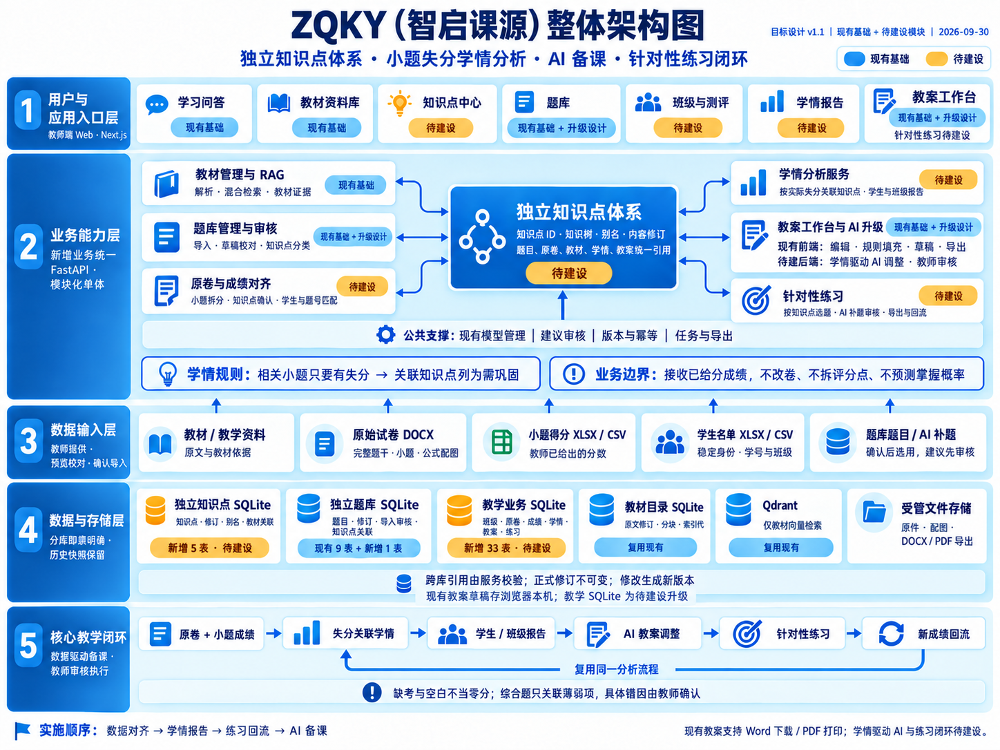

# 00 整体架构图

图版本：v1.1；日期：2026-09-30。对应本目录 v1.0 功能与数据库设计，是目标架构，待建设模块不代表已经上线。本次修正教案能力的现有/待建设状态，不改变数据库设计。[返回设计总说明](README.md)。

## 五层职责

| 层级 | 职责 |
|---|---|
| 用户与应用入口层 | 教师通过 Next.js 使用问答、教材、知识点、题库、测评、学情报告、教案与练习。 |
| 业务能力层 | 唯一 FastAPI 负责教材 RAG、知识点管理、题库审核、原卷与成绩对齐、失分学情、AI 教案调整与练习。模型管理、审核、版本、幂等、任务与导出提供公共支撑。 |
| 数据输入层 | 接收教材、原始试卷 DOCX、小题得分 XLSX/CSV、学生名单及题库题目；导入前提供预览、校对和确认。 |
| 数据与存储层 | 独立知识点 SQLite 新增 5 表；现有题库 9 表新增知识点关联 1 表；教学业务 SQLite 新增 33 表；保留现有教材目录与 Qdrant，另由受管目录保存原件和导出文件。 |
| 核心教学闭环 | 原卷与成绩 → 失分关联学情 → 学生/班级报告 → AI 教案调整 → 针对性练习 → 新成绩回流，并复用同一学情分析流程。 |

## 图中关键含义

- **知识点独立管理，题目与知识点通过关联表连接。** 一道题可关联多个知识点，题干不复制；教材可提供依据，不是题目归类的必经父级。
- **相关小题只要有失分，关联知识点就列为本次“需巩固”。** 原卷知识点须确认，成绩是教师已经给出的分数；不做自动改卷、评分点拆解、掌握概率预测或知识点分值分摊。
- 空白、缺考、免考不当作零分；真实零分属于有效失分。综合题失分关联多个知识点时，不能凭总分确定具体错因，需教师确认。
- 教案调整和 AI 补题先形成建议，教师审核后应用。图中的闭环顺序描述业务使用流程；页脚的实施顺序描述分阶段建设安排。
- Qdrant 仅用于教材向量检索；跨 SQLite 文件的引用由服务核验。正式修订保留历史，修改产生新版本。

## 状态与交付

蓝色标识为现有基础，黄色标识为待建设；“现有基础 + 升级设计”表示在现有题库、教案工作台等基础上扩展。

教案工作台已有字段编辑、教学环节调整、实时预览、撤销重做、本机草稿保存与恢复、JSON 备份导入、本地规则解析与确认填充、Word 下载和 PDF 打印。当前默认填充由 `RuleBasedFillProvider` 执行，不是真实大模型生成；草稿保存于浏览器本机，尚未接入新增教学业务 SQLite。

待建设部分是基于学情和教材依据的 AI 教案调整、后台教案持久化与版本、针对性练习生成及成绩回流。现有编辑、预览和导出作为升级基础继续复用。完整题干、公式和配图解析是目标要求，需通过真实 DOCX 验收。

首版优先 DOCX；PDF 导出按实际实现提供，现有浏览器打印方式不等于已经有后台 PDF 导出任务。新增表数量是完整目标模型，不要求第一阶段全部启用。

成图为 PNG，可放大阅读或插入文档；可编辑的实体、关系与模块图源码仍在 `diagrams/*.mmd`。v1.0 由内置 imagegen 全新生成，[原始规格](architecture-image-prompt.md)保留；v1.1 经同一工具编辑修正，见 [修订规格](architecture-image-edit-v1.1.md)。
