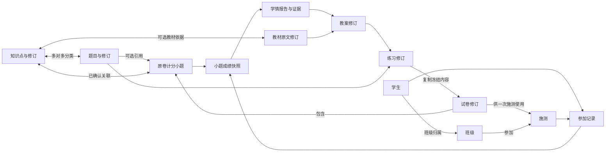
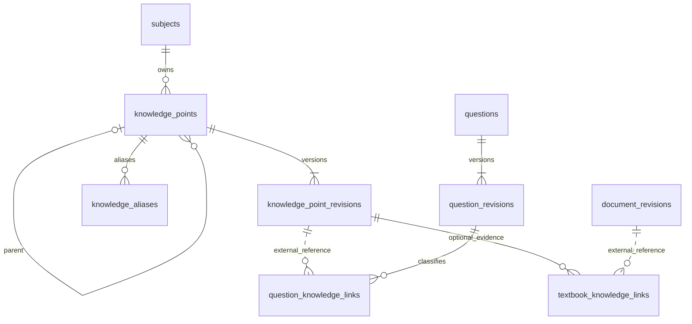
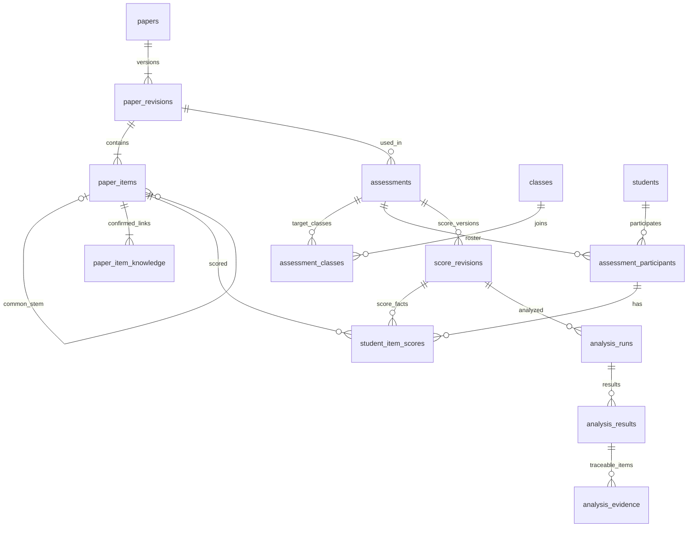
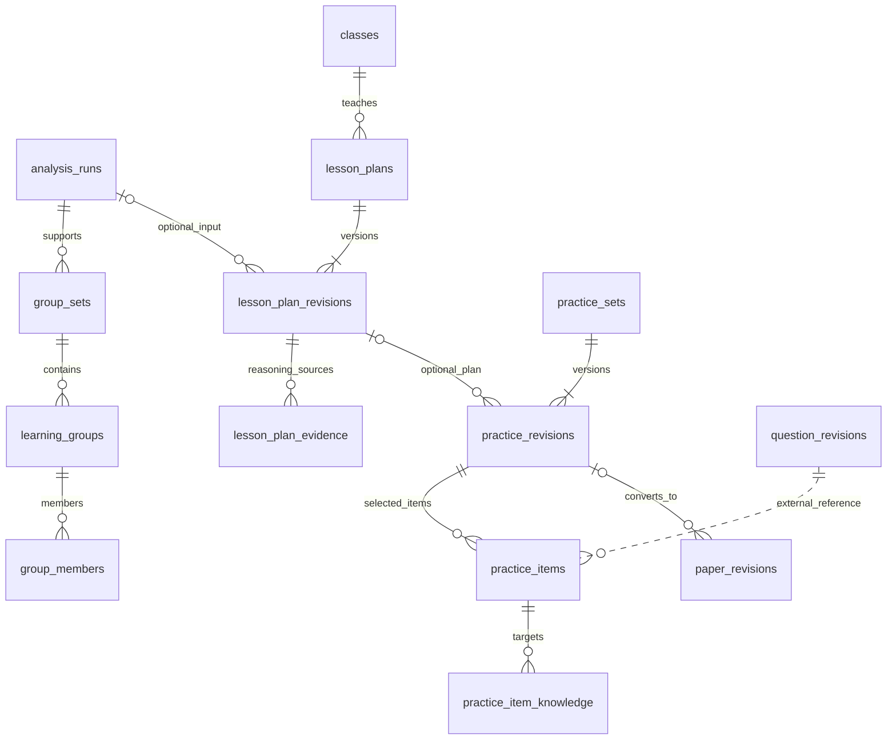

# 01 实体定义与实体图

[返回总说明](README.md)。本章描述业务对象；物理表字段见 06，完整表级 ER 见 05。

## 1. 核心实体

| 实体 | 含义 | 身份与版本 | 主要关系 |
|---|---|---|---|
| 学科 Subject | 对已有学科标识的正式登记 | 稳定 ID，保持既有 subjectId 兼容 | 学科下维护知识点；教材、试卷和题目核验同学科 |
| 知识点 KnowledgePoint | 独立于教材的一项概念或具体知识技能 | 稳定 ID + 不可变内容修订 | 可有上位知识点，关联多道题和多份教材依据 |
| 题目 Question | 可重复使用的完整试题内容 | 现有题目 ID + `question_revisions` | 一题可关联多个知识点，被试卷或练习引用 |
| 班级 Class | 一个学年中的教学班级 | ID + 编辑 revision | 多名学生通过带日期的归属关系入班 |
| 学生 Student | 真实学生的稳定本地身份 | ID；学号为业务键；姓名非身份 | 可有多次班级归属、多次参加测评记录 |
| 试卷 Paper | 教师上传的原卷或审核练习转换的卷 | 稳定 ID + 已确认试卷修订 | 一份修订有多个题干容器和计分小题 |
| 试卷小题 PaperItem | 原卷上能和成绩表列一一对应的计分单位 | 固定小题 ID，属于试卷修订 | 已确认知识点关联；只记录小题满分，不含评分点 |
| 施测 Assessment | 某日期使用指定试卷的一次考试、测验或练习 | 独立 ID，引用固定试卷修订 | 可有多个班级，形成参加名单与成绩版本 |
| 参加记录 Participant | 学生在一次施测中的某次参加 | ID + attempt_no | 固定学生、施测和班级；缺考也有记录 |
| 成绩修订 ScoreRevision | 教师提供的小题得分事实的全量版本 | ID + version，确认后不可变 | 包含每个参加记录与计分小题对应的成绩状态 |
| 学情报告 AnalysisRun | 指定成绩及名单选择下的失分关联结果 | ID + 输入指纹 + `any_loss_v1` | 每个学生知识点结果都能展开到小题成绩依据 |
| 临时分组 GroupSet | 为本节课目标建立的分组方案 | 独立 ID，关联指定报告 | 多个组，成员由教师确认；无永久能力标签 |
| 教案 LessonPlan | 一个班级和课题的教学设计 | ID + 内容修订 | 可引用学情、教材、临时分组与练习 |
| 练习 PracticeSet | 经审核的一组课堂或课后题目 | ID + 练习修订 | 引用题库修订，可转换成新试卷后导入成绩 |
| 文件 FileAsset | 原卷、名单、成绩表、配图或导出文件 | ID + 原字节散列 | 与实体分开，存受管文件键 |

教材目录、原文修订、Qdrant、模型配置为现有能力。它们提供依据或生成服务，不承担学生得分事实存储。

## 2. 概念实体总览

[打开业务实体图 SVG](diagrams/rendered/01-entities-01.svg)。

图中教材和题目分别关联知识点：不存在要求教师先建教材再建知识点、最后才能入题的父子存储链。

## 3. 知识点与题库局部实体图

稳定可用知识点和正式题目至少各有一份内容修订；建立草稿身份的事务中可短暂没有修订。表级图的 SQL 可选性和这一业务发布条件分开理解。多知识点题通过多行关联实现，不通过复制题目实现。

## 4. 原卷、成绩与学情局部实体图

只有 `is_scored=1` 的叶子小题必须关联至少一个知识点，题干容器可无知识点。容器不能再计分，避免大题与小题重复。上图 `paper_items → paper_item_knowledge` 的“至少一条”专指正式计分小题，数据库草稿阶段允许尚未标注。

## 5. 备课与练习局部实体图

教师可以先独立选题建练习，也可以从教案建立练习；无学情的旧教案仍可迁入。用于成绩回流的练习必须确认小题结构和满分，再转换成试卷修订，复用一次施测及成绩导入流程。

## 6. 不建立的实体

本版不建立学生答案识别、自动阅卷、评分点、题目知识点分值权重、掌握概率、知识追踪模型参数或长期能力等级表。原卷答案不是学情导入的必填内容；需要教师答案卷或 AI 补题时，答案按题库审核流程补充。
