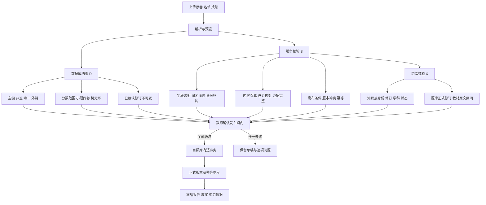

# 02 联系定义与完整性约束

[返回总说明](README.md)。`D` 表示参考 SQL 可保证；`S` 表示必须由同一 FastAPI 内的服务发布闸门保证；`X` 表示跨库逻辑引用，不能写成普通 SQL 外键。参考 DDL 的语法和约束验证不是业务服务已经实现的证明。

## 1. 联系定义

| 联系 | 基数及可选性 | 关联存储 | 约束层 |
|---|---|---|---|
| 学科—知识点 | 1:N；知识点恰属一个学科 | `knowledge_points.subject_id` | D；兼容已有 subjectId 为 S |
| 上位知识点—下位知识点 | 0..1:N；根无上位 | 同表 `parent_id` | D：同学科、无自指、无环 |
| 知识点—内容修订 | 1:N；发布时至少一个 | `knowledge_point_revisions` | D+S：当前指针只能指自己的修订 |
| 知识点—题目修订 | M:N；分类至少一个知识点的题才进入知识点筛选 | `question_knowledge_links` | D：题目本库外键；X：知识点有效性 |
| 知识点—教材修订 | M:N；可不关联教材 | `textbook_knowledge_links` | D：知识点本库外键；X：教材原文身份与区间 |
| 班级—学生 | M:N，带入班/离班日期 | `class_memberships` | D：重复活跃归属拒绝；S：时间范围 |
| 试卷—修订 | 1:N；每卷独立版本 | `paper_revisions` | D：版本唯一与当前指针归属 |
| 试卷修订—小题 | 1:N；确认时至少一个计分叶子 | `paper_items` | D：题号、序号、父子同卷、无环 |
| 小题—知识点 | M:N；正式计分小题至少一个 | `paper_item_knowledge` | D：确认前不得缺失；X：知识点修订 |
| 试卷修订—施测 | 1:N；同卷可多次使用 | `assessments.paper_revision_id` | D：只用已确认版本，施测不能换卷 |
| 施测—班级 | M:N；至少选一个班级才可导入成绩 | `assessment_classes` | D+S |
| 施测—参加记录 | 1:N；学生补考用另一 attempt_no | `assessment_participants` | D：学生+尝试唯一、班级属于本次施测 |
| 学生—参加记录 | 1:N | `assessment_participants.student_id` | D；参测时间与归属核验为 S |
| 施测—成绩修订 | 1:N；每版完整快照 | `score_revisions` | D：版本唯一；来源和旧版同施测 |
| 成绩修订—参加记录—小题 | 三元联系；每个组合至多一个成绩状态 | `student_item_scores` 复合主键 | D：同施测同试卷，分数值域 |
| 成绩修订—报告 | 1:N；不同班级选择可生成不同报告 | `analysis_runs` | D：已确认成绩；输入指纹去重；S：选择范围 |
| 报告—学生知识点结果 | 1:N | `analysis_results` | D：组合唯一、状态和计数基本一致；S：精确复算 |
| 结果—小题证据 | 1:N；无成绩也可展示 unavailable 状态 | `analysis_evidence` | D：来源成绩、知识点和报告对应；S：证据完整 |
| 报告—分组方案—组—成员 | 1:N:N:N；同方案中一个学生至多一个组 | `group_sets / learning_groups / group_members` | D：成员唯一；S：报告选择、班级范围一致 |
| 班级—教案 | 1:N | `lesson_plans.class_id` | D；学科及报告范围匹配为 S/X |
| 教案—修订—证据 | 1:N:N | `lesson_plan_revisions / lesson_plan_evidence` | D：审核版不覆写；S：结构与来源核验 |
| 教案修订—练习修订 | 0..1:N；练习可独立建立 | `practice_revisions.lesson_revision_id` | D；目标班级/组匹配为 S |
| 练习修订—题目修订 | M:N，带顺序和选题理由 | `practice_items` | X：确认题库修订；D：同练习序号唯一 |
| 练习修订—试卷修订 | 1:N；仅已审核练习允许转换 | `paper_revisions.source_practice_revision_id` | D+S：复制内容与满分，不共享可变草稿 |
| 工作任务—建议/导出 | 1:N | `workflow_jobs / ai_proposals / export_artifacts` | D：任务引用；S：目标类型、版本与结果语义 |

## 2. 完整性约束图

[打开完整性约束图 SVG](diagrams/rendered/02-relationships-and-constraints-01.svg)。

“教师确认”表示确认可检查的解析、映射和建议结果，不表示每次查看报告都要再次确认。

## 3. 数据库级约束 D

| 编号 | 规则 | SQL 实现位置 |
|---|---|---|
| D01 | 所有新增稳定 ID 非空唯一；关联关系用复合主键防重复 | 三份新增 DDL |
| D02 | 学号按 TEXT，用户内非空学号唯一；姓名允许重名 | `students` |
| D03 | 知识点父子同学科，无自指或祖先环 | `knowledge_points` 复合外键及递归触发器 |
| D04 | 小题父子同卷，无自指或祖先环；完整题号与顺序卷内唯一 | `paper_items` |
| D05 | 计分小题满分必须大于零；题干容器没有满分 | `paper_items` CHECK |
| D06 | 试卷确认时总分等于所有计分叶子满分之和，每个计分小题有知识点 | `paper_confirm` |
| D07 | 施测只能使用已确认卷；不能把已建立施测改指向另一修订 | `assessments` 触发器 |
| D08 | 得分对应的学生、成绩修订、小题、试卷均属于同一施测范围 | `student_item_scores` 复合外键 |
| D09 | 已录分满足 0≤分数≤小题满分；其他状态必须没有数值 | CHECK 和 `score_range_*` |
| D10 | 成绩确认时当前参加名单和全部计分小题都有显式状态行 | `score_confirm`；缺数据可记 missing，但不能省略行 |
| D11 | 成绩修订、试卷修订、教案审核版、练习审核版及 ready 报告不覆写 | 不可变与子表冻结触发器 |
| D12 | 当前修订指针不能指向其他实体的修订 | 复合外键，事务内延后校验 |
| D13 | 同一方案中同学生参加记录至多一个分组 | `group_members` 复合主键 |
| D14 | 报告证据引用该报告所用成绩版本，不能混用新旧分数 | `analysis_evidence` 复合外键 |
| D15 | 报告只允许 `any_loss_v1`；失分状态和基本计数一致 | `analysis_runs / analysis_results` CHECK |

新增修订先建草稿、写子表、校验，再转 confirmed/reviewed/ready；不允许直接插入已封存的父修订。新旧状态一起涉及同一事务；网络、文件解析与 LLM 推理均在 SQL 写事务之外。

## 4. 服务与跨库约束 S/X

| 编号 | 必须执行的校验 | 失败处理 |
|---|---|---|
| S01 | 原卷图片、公式、共用材料完整，未支持内容需教师补录或明确处理 | 保留原件和告警；不能假装已完整解析 |
| S02 | XLSX 单元格规范化、Decimal 转整数分数，最多两位小数；不把布尔/错误值当分数 | 在原行原列报错，禁止自动四舍五入 |
| S03 | 学生匹配使用学号或教师确认身份；同名不得静默选第一人 | 教师明确消歧，不能自动新增未知学生 |
| S04 | 成绩列完整题号对应唯一计分小题；大题总分只用于核对，不重复入分 | 显示缺列、多列、歧义题号 |
| S05 | 缺考/免考与有效得分冲突、负分、超分、总分不一致逐项展示 | 阻止异常值发布；缺失可显式确认为 missing |
| S06 | 导入 preview 到 confirm 期间，施测、名单和正式成绩版本未变化 | `REVISION_CONFLICT`，重新加载预览 |
| S07 | 每个跨库知识点 ID 与修订属于同一知识点且同学科；新使用不选归档项 | `KNOWLEDGE_REFERENCE_INVALID` |
| S08 | 顶层学科 ID 对齐现有项目字典；不得生成另一套不兼容代码 | 配置或迁移错误，不静默猜测 |
| S09 | 题目修订真实存在、已确认且归属允许访问；练习答案卷所需答案已审核 | 缺资源阻止审核，学生卷是否无答案由教师明确选择 |
| S10 | 教材修订与定位区间真实存在；RAG 范围由教师选择并冻结 | 失效或越界时报错，不以题名推断范围 |
| S11 | 报告 selection 只选该施测内记录；同一学生的多个尝试必须明确选一次 | 否则不生成班级人数统计 |
| S12 | 报告结果与所有小题证据完整复算；loss_count、计数及分数和不能由 AI 填写 | 不转 ready；保留失败原因 |
| S13 | 学情报告的有效成绩来自录分事实；0 分有效，missing/absent/exempt 不算失分 | 输出 no_evidence 或 incomplete |
| S14 | 教师说明与事实分开；修正原分必须走新成绩版本 | 不允许说明字段覆盖分数或失分证据 |
| S15 | 分组成员来自指定报告与班级；教案报告、分组和课题范围一致 | 阻止跨班级、跨报告混用 |
| S16 | 教案结构、课时总时长、目标与练习资源完整；引用校验后再审核 | 给教师可修改的具体字段问题 |
| S17 | 练习含至少一题，知识点覆盖与题量/时长由教师检查；题目分值与小题结构明确 | 不导出最终练习或不转换回流测评 |
| S18 | 练习转试卷时复制选定小题和材料；复合题必须在原卷校对页确认小题满分 | 只采教师分值，不拆评分点或自动分摊知识点分值 |
| S19 | AI 建议目标 ID、类型和 base_revision 与当前草稿一致 | 过期建议变 stale，不覆盖人工编辑 |
| S20 | 幂等记录同 submissionId 同 requestHash 返回相同结果；不同请求报冲突 | 每次正式目标写入与记录同库事务提交 |
| S21 | 数据根不可用、损坏、表缺失不能当空库初始化后覆盖 | 明确存储错误，保留编辑与重试入口 |
| S22 | 文件键不得越出受管根；散列与字节数核验；原件、模板不覆盖 | 导入失败，不移动或删除源文件 |
| S23 | 日期格式、人员归属区间、current 指针只引用正式/可用修订 | 在服务层校验；SQL 字符串排序不代替日期解析 |
| S24 | 已被成绩引用的参加记录的学生/班级/attempt 身份不可改变；补考新增记录 | 旧报告用旧 roster_snapshot，后续版本明确选择新增尝试 |
| S25 | 同一知识点在同份卷中原则上使用同一内容修订；有冲突需教师确认统一 | 避免报告只显示一个名字却混用不同概念修订 |

数据库中 `json_valid` 只保证 JSON 语法。合法 JSON 可以仍缺少业务字段，服务必须按契约校验，不能把 JSON 列当绕过联系和约束的容器。

## 5. 跨库发布与恢复

跨库校验按独立服务读取，不使用共享连接互相打开现有题库/教材库。SQL 外键只在本库内声明。单用户服务中的归档/标注/发布经过统一写入协调：校验后冻结外部 ID、修订、名称与必要内容，再在目标库短事务内发布。外部引用的新使用闸门与归档操作串行，降低检查后状态变化的竞争；再次使用前重新核验。

知识点语义内容和正式题目修订保留，不硬删除被引用版本。外部库不可用时，新发布应报不可用；历史报告/导出可读本库快照并标明来源暂不可访问，不能冒充完成新的外部核验。

备份应在所有写入暂停的受控离线窗口获取四份 SQLite、引用文件和教材 Qdrant 快照，并记录版本、散列及引用清单；部分完成不标 complete。恢复只写新目录，检查所有数据库和外部引用后才供应用使用。本设计不承诺跨多个数据库的原子热备。
