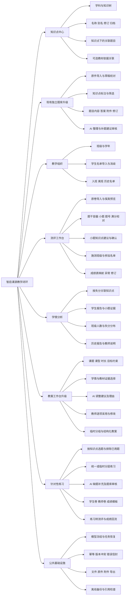
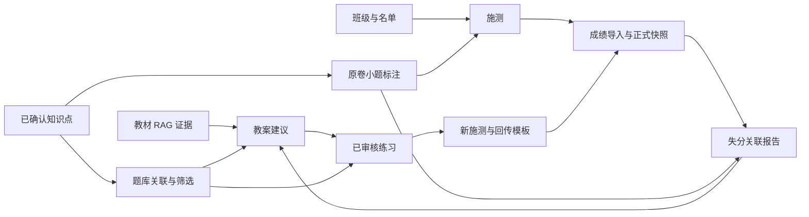

# 03 细化功能模块图

[返回总说明](README.md)。模块按业务职责划分，独立功能不必各建一个顶层页面。规划模块不提前创建生产空实现。

## 1. 模块分解图

[打开细化功能模块图 SVG](diagrams/rendered/03-function-modules-01.svg)。

## 2. 数据依赖图

学情分析本身不依赖题库或 RAG 在线：只要原卷、小题知识点和得分已确认，就能完成报告。题库提供可复用题资源；RAG 为备课提供教材依据，不替代成绩事实。

## 3. 代码模块职责建议

| 模块 | 前端建议归属 | 后端建议职责 | 数据拥有者 |
|---|---|---|---|
| 知识点中心 | `features/knowledge-points` | `services/knowledge_taxonomy` | knowledge 库 |
| 教学组织 | `features/classroom`，学生详情作为子功能 | `services/classroom` | teaching 库 |
| 测评工作台 | `features/assessment`，包含原卷/成绩导入子流程 | `services/assessment` | teaching 库 |
| 学情分析 | `features/learning-analytics`，学生画像作为报告视图 | `services/learning_analytics` | teaching 库 |
| 题库 | 复用 `features/question-bank` | 扩展现有 `services/question_bank` | question-bank 库 |
| 教案 | 复用 `features/lesson-plan` | `services/lesson_planning` | teaching 库，兼容旧草稿 |
| 练习 | `features/practice` | `services/practice_generation` | teaching 库 |
| 教材依据 | 复用现有知识库与教材范围选择 | 现有教材目录与 RAG 服务 | textbooks 库及 Qdrant |

路由保持薄层；列表、导入、校对、报告和建议审阅在同一业务模块组织。跨模块类型置于 contracts，仓储只负责本库读取和事务。统一错误信封沿用 `code/message/requestId/retryable/details`。

## 4. 建议入口与页面

| 页面 | 主要操作 | 对外能力状态 |
|---|---|---|
| `/knowledge-points` | 知识树、别名、关联题目、教材依据 | 未实现前 planned |
| `/classroom` | 班级与名单导入 | 未实现前 planned |
| `/assessments` | 测评列表、新建、复用原卷 | 未实现前 planned |
| `/assessments/[id]/paper` | 原卷与小题校对、知识点确认 | 未实现前 planned |
| `/assessments/[id]/scores` | 得分映射、异常与成绩修订 | 未实现前 planned |
| `/assessments/[id]/analytics` | 学生/班级失分关联报告 | 未实现前 planned |
| `/question-bank` | 保留已有入口，新增知识点分类筛选 | 已有能力以 CURRENT_STATUS 为准 |
| 现有教案工作台 | 新增学情依据和 AI 建议，不另起第二个教案系统 | V2 未实现前单独标 planned |
| `/practice` | 练习编辑、审核、导出和回流 | 未实现前 planned |

以上是路由设计，不是现行 API 或路由登记。实施时才同步 `docs/API.md` 与 `docs/ROUTES.md`。
