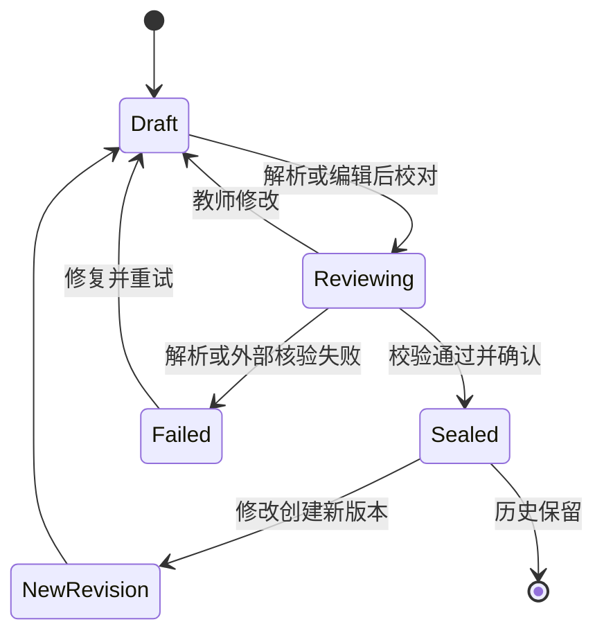

# 04 功能说明文档

[返回总说明](README.md)。第一版学情逻辑是已确认小题知识点与实际失分的直接关联，不使用掌握度预测模型，不承担改卷工作。

## F01 知识点中心

**输入：** 学科、名称、定义、上位知识点、可选别名。**输出：** 稳定知识点 ID、正式内容修订和可检索知识树。

教师可新建、调整目录、改名、新增别名和归档。名称变化新增内容修订；ID 不变。归档隐藏于新选项，保留历史显示。别名可能在同学科指向多个知识点，搜索须让教师选择，不能仅凭名称自动合并。知识点页面下直接展示关联题目；教材关联是可选依据面板，不是创建题目的前置条件。

校验：同学科代码唯一、父子同学科、无循环；学科 ID 与项目已有字典兼容。将范围不同的两个概念合并不是改名操作，需新建映射修订并让教师确认，第一版不提供自动概念合并。

## F02 知识点题库

**输入：** 现有题目修订、一个或多个知识点。**输出：** 已确认题目知识点关联及可按知识点查询的题目列表。

复用现有导入—草稿—AI 建议—校对—确认链路。自由字符串 `knowledgeTags` 保留旧数据兼容；新正式分类使用 `question_knowledge_links`。旧标签仅产生待确认候选，不批量猜测为正式 ID。

同一题只存一份题干修订，可出现在多个知识点列表。修改正式知识点关联时创建新题目修订及关联，历史练习继续使用旧修订。支持知识点、题型、教师标注难度、来源筛选；题目实际得分分布可作为后续事实展示，不用于本版自动预测学生能力。

原卷小题进入学情不要求先入题库。教师可选中小题另行送入题库校对；缺答案允许按现有规则明确登记，但不能把“允许缺答案入库”冒充“答案已经正确可供教师答案卷使用”。

## F03 班级与名单

**输入：** XLSX/CSV 名单，至少姓名，可有学号、班级。**输出：** 班级、稳定学生身份和带日期的班级归属。

上传后先选择工作表和表头，预览字段映射；学号保持文本。学号匹配已有身份，同名不能自动覆盖。无学号时需教师确认身份或新建身份；不得将不同班同名学生合并。重复行、未知班级、冲突学号在确认前显示。

导入在本库单事务内完成；同一 submissionId 重试不重复建人。转班保留旧归属与旧测评班级。性别、联系方式不是这条闭环必填字段，第一版无需采集。

## F04 原卷解析与小题校对

**输入：** 原始试卷 DOCX。首版优先 DOCX，扫描件/OCR 不在首版承诺范围。**输出：** 试卷草稿、共享题干、小题完整内容、题号、满分和来源定位。

流程：登记原件并校验散列 → 解析段落/表格/公式/配图 → 规则拆题 → 显示未归属材料与遗漏告警 → 教师拆分/合并/调整题号 → 确认可计分小题与满分。

“小题”严格对应成绩表已有计分列，例如 `16(1)`。无需建立该小题内部的评分步骤。阅读材料或第 16 题总题干作为 `is_scored=0` 容器；若已有 `16(1)` 与 `16(2)` 计分列，第 16 题总分只能用于核对。

支持多小题共用材料，切题不能把材料丢失。DOCX 的真实分页取决于字体和排版；若使用转换预览，保存原件定位与预览页定位的对应，不把段落序号声称为原件固定页码。现有解析器对公式/图片存在提取边界，保真能力是实施任务，不能从现有“支持 docx”推导为已完整支持原卷。

## F05 小题知识点确认

**输入：** 小题原文、所选学科的知识点候选、可选题库已有标注。**输出：** 每个计分小题至少一个已确认知识点关联。

AI 只能从给定候选或正式知识点库提出建议，并附依据；不能静默创建未知知识点或直接改人工标注。教师可新增候选知识点，但须经过 F01。正式关联可有 primary/secondary 角色，所有关联都进入失分归并，不设置知识点分值权重。

确认整卷时检查小题满分之和等于总分，计分小题均为叶子且标注完整。确认后内容、满分和关联不变；需要修改则建立新的试卷修订。已施测记录不自动换卷。

## F06 一次测评与参加名单

**输入：** 已确认试卷修订、名称、日期、测评类型、班级、名单。**输出：** 一次施测 ID 与参加记录。

同一试卷可被多个班或不同日期重复使用。创建时按施测日期核对班级归属，冻结名称和学号。缺考/免考也有参加记录，用显式状态处理。补考新增参加记录或另建施测，不能覆盖首次记录；同一报告对一个学生默认只选择教师指定的一次尝试。

## F07 小题得分表导入与修正

**输入：** 教师已经给出分数的 XLSX/CSV，目标施测。**输出：** 经确认的全量成绩修订。

流程：选工作表 → 识别姓名/学号列及题号列 → 教师确认学生匹配 → 题号对齐 → 逐格数值检查 → 预览异常 → 确认正式快照。

首版支持宽表：一行学生，一列小题。学号、姓名、总分、班级等非小题列不进入题分表。Excel `16（1）`、`16-1` 等可以作为候选映射，但教师预览中必须看到最终完整题号；有歧义不自动决定。

分数最多两位小数，使用 Decimal 精确转换为百分之一分整数；不四舍五入静默更改源分数。读取 XLSX 公式时不执行公式；没有可用缓存值则要求教师另存值表。布尔值、错误值、文本、负分、超满分均不当作合法分数。

0 分是有效分数，属于失分；空白是 missing，不等于 0。缺考与免考使用显式状态。预览可显示缺失，但正式版本每位参加者每个计分小题都有状态行，不能用漏行掩盖数据。总分列只核对小题和；存在缺失时显示无法完整核对。

重复导入由文件指纹和导入预览提示，正式幂等以 submissionId 和请求指纹保证。纠错生成新的全量成绩版本：保留未改分数，写入修改，确认后切换当前指针。旧报告仍用旧版本。

## F08 学生学情分析

**输入：** 固定试卷修订、正式成绩修订、选择的参加记录和 `any_loss_v1`。**输出：** 学生知识点表现、小题证据和资料完整性提示。

规则顺序：

1. 找出该小题所有教师已确认的知识点关联。
2. 对 recorded 成绩比较实际得分与本题满分。
3. 实际得分小于满分时，相关知识点列入“需巩固”；同知识点多道失分题只产生一个知识点结果，保留全部依据。
4. missing/absent/exempt 不产生失分事实，也不参与有效分数和。
5. 综合题多知识点时列出关联项，提示无法仅凭总分精确确定错因；不分摊失分。

| 条件，按上到下判断 | observation | 显示 |
|---|---|---|
| 至少一道相关有效小题有失分 | `needs_consolidation` | 本次需巩固；如还有缺失另加提示 |
| 无任何相关有效录分 | `no_evidence` | 暂无有效依据 |
| 有有效分数，已知题均满分，但还有缺失小题 | `incomplete` | 成绩资料不全，暂不作完整判断 |
| 所有关联小题均有有效分数且均满分 | `full_credit` | 本次相关题均满分 |

结果展示知识点、关联小题数、有效题数、失分小题数、失分题号、实际得分/满分和资料缺失数。可以展示事实上的分数合计，但不标成“掌握概率”。教师说明单独记录；改变得分走 F07。

## F09 班级学情与历史报告

**输入：** 指定报告与班级选择。**输出：** 每个知识点的需巩固学生人数、无依据人数、相关小题得分事实、学生列表。

学生按稳定 ID 去重，补考选择在生成前明确。显示班级总人数、实际选择人数、有有效依据人数；分母不能混用。知识点人数可重叠，不能相加当总人数。可看单题失分分布和平均分，但由程序从实际分数计算，LLM 不负责填数字。

历史报告按日期与版本保留，展示每次原卷和证据构成。两次考试范围、难度不同，报告不能自动断言能力提升或教学因果效果。相同或可比练习可作为教师观察变化的依据，并保留是否为原题再次出现的信息。

## F10 AI 教案调整

**输入：** 课题、班级、课型、课时、课堂时长、教师选定学情报告、教材范围、可用设备和已审核题目。**输出：** 结构化教案建议及每处调整的依据。

先整理班级聚合学情及相关失分小题，再核验教材原文范围和选题资源。生成目标、重难点、过程、学生任务、检测、练习、课后作业和反思模板。反思记录真实课后情况前不填“学生已掌握”等虚构教学效果。

建议包含“调整哪个环节、为什么调整、用何种题目检测、预计用时”。时间总和符合教师设定；证据不足时建议短检测，不虚构具体错因。当前聊天所选模型在点击生成时冻结，调用失败不换模型、不返回模拟成功。

AI 输出进入建议区，教师逐项接受或修改。检查 base_revision，过期建议不覆盖人工草稿。旧 `LessonPlanData` 保持读取与导出兼容；迁入 V2 形成新内容版本，原 Word 模板不改。

原始名单和完整逐生分数留本地；班级教案使用聚合人数和知识点失分依据。云端调用不自动附带姓名、学号或原始成绩文件。不得依赖脱敏后仍包含个人身份线索的隐藏附件。

## F11 临时分组

**输入：** 本节课目标、指定报告、教师选定的分组条件。**输出：** 可修改的本课分组方案。

分组可依据不同失分知识点组合安排不同练习，也可由教师手工调整。A/B/C 仅表示当前方案，系统不维护永久优劣等级。同方案学生不重复入组；无有效成绩的学生由教师安排，不自动分入最弱组。

## F12 针对性练习与 AI 补题

**输入：** 目标知识点、统一或分层对象、题量、时长、题型、教师标注难度、是否排除已用原题。**输出：** 练习草稿与已审核练习修订。

按知识点查询正式题库修订，展示选题理由、题干、共用材料、答案状态和预计时长。教师可更换、删除、排序或补题。同一题多个知识点不重复选入；需要故意重复时明确展示并确认。

AI 补题进入既有题库草稿/建议机制，经过知识点、条件、答案、解析和图形审核后才能成为正式题目修订并选入练习。LLM 自检或另一个模型同意不等于题目正确。补题任务扩展现有 question_jobs，不再建第二套题库任务表。

完整复合题用于回流时，教师必须确认成绩表小题结构，例如 `3(1)`、`3(2)`，以及各自满分。practice_items 记录选题时的整体题目分值；转换 paper_items 时可拆成多个计分小题，其满分之和与该题整体分值一致，仍不涉及内部评分点。

## F13 导出与成绩回流

**输入：** 固定教案、报告或已审核练习修订。**输出：** DOCX、可选 PDF、成绩 XLSX/CSV 模板及可查询导出记录。

练习支持学生卷与教师答案卷分开导出。验证公式、配图、表格、共用题干、不割裂题块、答题空间与分页。DOCX 必须可编辑；PDF 如仅通过浏览器打印，界面明确是打印另存，不能声称后端已生成可靠 PDF 文件。

回流先将已审核练习转成确认试卷修订，再创建施测和名单，最后导出固定题号/满分的录入模板。模板带施测 ID、试卷修订 ID 和版本信息；身份列按文本，题号与原卷一致。教师完成练习后只回传已给出的每小题得分，走 F07/F08，不上传作答图像来自动批改。

导出结果绑定 input_hash 和实体修订，重试不会在同名文件上静默覆盖另一版本；文件下载失败保留原有编辑和重试入口。

## F14 任务、错误与恢复

长解析、模型生成和导出运行在事务外。任务记录冻结输入、模型身份、阶段与错误；队列/运行/成功/失败/取消/中断状态明确。进程重启发现 running 时标 interrupted，允许重新执行该任务；不声称供应商中断流可逐字节恢复。

关键确认使用 submissionId、requestHash 与编辑 revision。校验失败返回逐条问题；存储/模型不可用返回既有错误信封，不伪装空结果或题目内容无效。部分草稿、待确认建议、已编辑内容保留。

## 5. 状态流程

上图是共同业务状态。各表枚举并非都含 Reviewing/Failed：试卷、成绩在父表 draft 内承载校对；失败由 import/job 记录；教案/练习 sealed 对应 reviewed；报告 sealed 对应 ready。

## 6. 首版验收场景

| 场景 | 必须观察到的行为 |
|---|---|
| 单题关联一个知识点，得分低于满分 | 知识点进入需巩固，展开显示原题和实际分数 |
| 同知识点三题，只有一题失分 | 仍需巩固，不用平均分抵消该条失分 |
| 真实零分 | 有效失分依据，不能当作缺数据 |
| 全部满分 | 显示本次相关题均满分，不标长期完全掌握 |
| 一题满分、一题未录入 | incomplete，不能显示所有题已掌握 |
| 缺考或全部空白 | no_evidence，无失分诊断 |
| 综合题关联多个知识点且失分 | 所有关联项列需巩固，明确具体错因未确定 |
| 两位同名学生 | 必须消歧，不能把分数写到错误学生 |
| 16 容器与 16(1)/16(2) | 只计小题，总题干保留，父容器不重复计分 |
| 超分、负分、公式缓存缺失 | 阻止该值发布并定位异常行列 |
| 重复确认提交 | 返回原结果，不重复生成成绩版本 |
| 导入期间他处修改正式成绩 | 版本冲突，保留待导入数据 |
| 修改已确认成绩 | 新版本新报告，旧报告证据不变 |
| AI 建议期间教师编辑教案 | 过期建议不覆盖当前编辑 |
| 题库或知识点库不可用 | 新发布报不可用；既有历史快照可读但不能假装重新核验 |
| 完整练习回流 | DOCX 题号、模板列、施测小题一致，可再次生成报告 |
| 公式/图形原卷与导出 | 人工逐题确认内容完整，另做分页视觉验收 |

这些是实施验收条件，本次设计验证不能替代真实文件、真实模型和教师教学质量验收。
