# 05 总实体 ER 图

[返回总说明](README.md)。图包含 39 张新增表，以及现有被引用的题目、题目修订、教材文档和教材修订实体。其余现有技术表的只读结构附在 06 和 sql/existing-*.sql。

联系标签 **FK** 为同库 SQL 外键，**EXT** 为跨库逻辑引用；跨库不具备普通 SQL 外键。实线表示识别联系（外键组成子表主键），虚线表示非识别联系。左端圆圈表示该外键可空；草稿可选性与正式发布时至少一个小题/修订的规则见 01、02。大图请打开 SVG 放大查看，业务概念图见 01。

[总 ER 图 SVG](diagrams/rendered/05-total-er.svg)

```mermaid
erDiagram
    knowledge_aliases {
        TEXT id PK
        TEXT knowledge_point_id FK
        TEXT alias 
        TEXT normalized_alias 
        TEXT created_at 
    }
    knowledge_points ||..o{ knowledge_aliases : "FK_knowledge_point_id"
    knowledge_point_revisions {
        TEXT id PK
        TEXT knowledge_point_id FK
        INTEGER version 
        TEXT name 
        TEXT description 
        TEXT created_at 
    }
    knowledge_points ||..o{ knowledge_point_revisions : "FK_knowledge_point_id"
    knowledge_points {
        TEXT id PK,FK
        TEXT subject_id FK
        TEXT code 
        TEXT parent_id FK
        TEXT current_revision_id FK
        INTEGER sort_order 
        TEXT status 
        INTEGER revision 
        TEXT created_at 
    }
    knowledge_point_revisions |o..o| knowledge_points : "FK_current_revision_id/id"
    knowledge_points |o..o{ knowledge_points : "FK_parent_id/subject_id"
    subjects ||..o{ knowledge_points : "FK_subject_id"
    subjects {
        TEXT id PK
        TEXT code 
        TEXT name 
        TEXT status 
    }
    textbook_knowledge_links {
        TEXT id PK
        TEXT knowledge_point_id FK
        TEXT knowledge_revision_id FK
        TEXT document_revision_id 
        TEXT locator_json 
        TEXT locator_hash 
        TEXT title_snapshot 
        TEXT source 
        TEXT created_at 
    }
    knowledge_point_revisions ||..o{ textbook_knowledge_links : "FK_knowledge_revision_id/knowledge_point_id"
    ai_proposals {
        TEXT id PK
        TEXT job_id FK
        TEXT target_kind 
        TEXT target_id 
        INTEGER base_revision 
        TEXT payload_json 
        TEXT state 
        TEXT created_at 
    }
    workflow_jobs ||..o{ ai_proposals : "FK_job_id"
    analysis_evidence {
        TEXT run_id PK,FK
        TEXT participant_id PK,FK
        TEXT knowledge_point_id PK,FK
        TEXT item_id PK,FK
        TEXT score_revision_id FK
        TEXT knowledge_revision_id 
        INTEGER is_loss 
    }
    paper_item_knowledge ||--o{ analysis_evidence : "FK_item_id/knowledge_point_id"
    student_item_scores ||..o{ analysis_evidence : "FK_score_revision_id/participant_id/item_id"
    analysis_runs ||..o{ analysis_evidence : "FK_run_id/score_revision_id"
    analysis_results ||--o{ analysis_evidence : "FK_run_id/participant_id/knowledge_point_id"
    analysis_results {
        TEXT run_id PK,FK
        TEXT participant_id PK,FK
        TEXT knowledge_point_id PK
        TEXT knowledge_name_snapshot 
        TEXT observation 
        INTEGER expected_count 
        INTEGER valid_count 
        INTEGER loss_count 
        INTEGER earned_units 
        INTEGER available_units 
    }
    assessment_participants ||--o{ analysis_results : "FK_participant_id"
    analysis_runs ||--o{ analysis_results : "FK_run_id"
    analysis_runs {
        TEXT id PK
        TEXT assessment_id FK
        TEXT score_revision_id FK
        TEXT rule_code 
        TEXT selection_json 
        TEXT roster_snapshot_json 
        TEXT input_hash 
        TEXT state 
        TEXT created_at 
    }
    score_revisions ||..o{ analysis_runs : "FK_score_revision_id/assessment_id"
    analysis_teacher_notes {
        TEXT id PK
        TEXT run_id FK
        TEXT participant_id FK
        TEXT knowledge_point_id 
        TEXT note 
        TEXT created_at 
    }
    assessment_participants |o..o{ analysis_teacher_notes : "FK_participant_id"
    analysis_runs ||..o{ analysis_teacher_notes : "FK_run_id"
    assessment_classes {
        TEXT assessment_id PK,FK
        TEXT class_id PK,FK
    }
    classes ||--o{ assessment_classes : "FK_class_id"
    assessments ||--o{ assessment_classes : "FK_assessment_id"
    assessment_participants {
        TEXT id PK
        TEXT assessment_id FK
        TEXT student_id FK
        TEXT class_id FK
        INTEGER attempt_no 
        TEXT attendance 
        TEXT name_snapshot 
        TEXT student_no_snapshot 
    }
    assessment_classes ||..o{ assessment_participants : "FK_assessment_id/class_id"
    students ||..o{ assessment_participants : "FK_student_id"
    assessments {
        TEXT id PK,FK
        TEXT owner_id 
        TEXT paper_revision_id FK
        TEXT title 
        TEXT assessment_type 
        TEXT held_on 
        TEXT active_score_revision_id FK
        TEXT state 
        INTEGER revision 
        TEXT created_at 
    }
    score_revisions |o..o| assessments : "FK_active_score_revision_id/id"
    paper_revisions ||..o{ assessments : "FK_paper_revision_id"
    class_memberships {
        TEXT id PK
        TEXT class_id FK
        TEXT student_id FK
        TEXT joined_on 
        TEXT left_on 
    }
    students ||..o{ class_memberships : "FK_student_id"
    classes ||..o{ class_memberships : "FK_class_id"
    classes {
        TEXT id PK
        TEXT owner_id 
        TEXT code 
        TEXT name 
        TEXT school_year 
        TEXT grade_id 
        TEXT status 
        INTEGER revision 
        TEXT created_at 
    }
    command_submissions {
        TEXT submission_id PK
        TEXT operation 
        TEXT request_hash 
        TEXT result_json 
    }
    export_artifacts {
        TEXT id PK
        TEXT job_id FK
        TEXT file_id FK
        TEXT entity_kind 
        TEXT entity_id 
        TEXT variant 
        TEXT format 
        TEXT input_hash 
        TEXT created_at 
    }
    file_assets ||..o{ export_artifacts : "FK_file_id"
    workflow_jobs ||..o{ export_artifacts : "FK_job_id"
    file_assets {
        TEXT id PK
        TEXT owner_id 
        TEXT kind 
        TEXT blob_key 
        TEXT sha256 
        TEXT original_name 
        TEXT media_type 
        INTEGER byte_size 
        TEXT created_at 
    }
    group_members {
        TEXT group_set_id PK,FK
        TEXT group_id FK
        TEXT participant_id PK,FK
    }
    learning_groups ||..o{ group_members : "FK_group_id/group_set_id"
    assessment_participants ||--o{ group_members : "FK_participant_id"
    group_sets ||--o{ group_members : "FK_group_set_id"
    group_sets {
        TEXT id PK
        TEXT run_id FK
        TEXT topic 
        TEXT criteria_json 
        TEXT created_at 
    }
    analysis_runs ||..o{ group_sets : "FK_run_id"
    learning_groups {
        TEXT id PK
        TEXT group_set_id FK
        TEXT label 
        TEXT name 
        INTEGER ordinal 
    }
    group_sets ||..o{ learning_groups : "FK_group_set_id"
    lesson_plan_evidence {
        TEXT id PK
        TEXT lesson_revision_id FK
        TEXT kind 
        TEXT target_path 
        TEXT source_ref_json 
        TEXT content_snapshot 
        TEXT sha256 
    }
    lesson_plan_revisions ||..o{ lesson_plan_evidence : "FK_lesson_revision_id"
    lesson_plan_revisions {
        TEXT id PK
        TEXT lesson_plan_id FK
        INTEGER version 
        TEXT analysis_run_id FK
        TEXT group_set_id FK
        INTEGER schema_version 
        TEXT context_json 
        TEXT content_json 
        TEXT model_snapshot_json 
        TEXT source 
        TEXT state 
        TEXT created_at 
    }
    group_sets |o..o{ lesson_plan_revisions : "FK_group_set_id"
    analysis_runs |o..o{ lesson_plan_revisions : "FK_analysis_run_id"
    lesson_plans ||..o{ lesson_plan_revisions : "FK_lesson_plan_id"
    lesson_plans {
        TEXT id PK,FK
        TEXT owner_id 
        TEXT class_id FK
        TEXT subject_id 
        TEXT title 
        TEXT current_revision_id FK
        TEXT status 
        INTEGER revision 
        TEXT created_at 
    }
    lesson_plan_revisions |o..o| lesson_plans : "FK_current_revision_id/id"
    classes ||..o{ lesson_plans : "FK_class_id"
    paper_item_knowledge {
        TEXT item_id PK,FK
        TEXT paper_revision_id FK
        TEXT knowledge_point_id PK
        TEXT knowledge_revision_id 
        TEXT knowledge_name_snapshot 
        TEXT role 
        TEXT source 
    }
    paper_items ||..o{ paper_item_knowledge : "FK_item_id/paper_revision_id"
    paper_items {
        TEXT id PK
        TEXT paper_revision_id FK
        TEXT parent_item_id FK
        TEXT question_no 
        INTEGER ordinal 
        INTEGER is_scored 
        INTEGER max_score_units 
        TEXT question_revision_id 
        TEXT content_json 
        TEXT source_locator_json 
    }
    paper_items |o..o{ paper_items : "FK_parent_item_id/paper_revision_id"
    paper_revisions ||..o{ paper_items : "FK_paper_revision_id"
    paper_revisions {
        TEXT id PK
        TEXT paper_id FK
        INTEGER version 
        TEXT source_file_id FK
        TEXT source_practice_revision_id FK
        INTEGER total_score_units 
        TEXT state 
        TEXT confirmed_at 
        TEXT created_at 
    }
    practice_revisions |o..o{ paper_revisions : "FK_source_practice_revision_id"
    file_assets |o..o{ paper_revisions : "FK_source_file_id"
    papers ||..o{ paper_revisions : "FK_paper_id"
    papers {
        TEXT id PK,FK
        TEXT owner_id 
        TEXT subject_id 
        TEXT title 
        TEXT current_revision_id FK
        TEXT status 
        INTEGER revision 
        TEXT created_at 
    }
    paper_revisions |o..o| papers : "FK_current_revision_id/id"
    practice_item_knowledge {
        TEXT item_id PK,FK
        TEXT knowledge_point_id PK
        TEXT knowledge_revision_id 
        TEXT knowledge_name_snapshot 
        TEXT role 
    }
    practice_items ||--o{ practice_item_knowledge : "FK_item_id"
    practice_items {
        TEXT id PK
        TEXT practice_revision_id FK
        INTEGER ordinal 
        TEXT question_revision_id 
        TEXT content_json 
        TEXT selection_reason 
        INTEGER max_score_units 
        INTEGER estimated_seconds 
    }
    practice_revisions ||..o{ practice_items : "FK_practice_revision_id"
    practice_revisions {
        TEXT id PK
        TEXT practice_set_id FK
        INTEGER version 
        TEXT lesson_revision_id FK
        TEXT group_id FK
        TEXT constraints_json 
        TEXT state 
        TEXT created_at 
    }
    learning_groups |o..o{ practice_revisions : "FK_group_id"
    lesson_plan_revisions |o..o{ practice_revisions : "FK_lesson_revision_id"
    practice_sets ||..o{ practice_revisions : "FK_practice_set_id"
    practice_sets {
        TEXT id PK,FK
        TEXT owner_id 
        TEXT subject_id 
        TEXT title 
        TEXT current_revision_id FK
        TEXT status 
        INTEGER revision 
        TEXT created_at 
    }
    practice_revisions |o..o| practice_sets : "FK_current_revision_id/id"
    score_import_rows {
        TEXT import_id PK,FK
        INTEGER row_no PK
        TEXT participant_id FK
        TEXT raw_cells_json 
        TEXT issues_json 
    }
    assessment_participants |o..o{ score_import_rows : "FK_participant_id"
    score_imports ||--o{ score_import_rows : "FK_import_id"
    score_imports {
        TEXT id PK
        TEXT assessment_id FK
        TEXT file_id FK
        TEXT base_score_revision_id FK
        TEXT mapping_json 
        TEXT state 
        INTEGER revision 
        TEXT created_at 
    }
    score_revisions |o..o{ score_imports : "FK_base_score_revision_id/assessment_id"
    file_assets ||..o{ score_imports : "FK_file_id"
    assessments ||..o{ score_imports : "FK_assessment_id"
    score_revisions {
        TEXT id PK
        TEXT assessment_id FK
        INTEGER version 
        TEXT source_import_id FK
        TEXT base_revision_id FK
        TEXT state 
        TEXT confirmed_at 
        TEXT created_at 
    }
    score_revisions |o..o{ score_revisions : "FK_base_revision_id/assessment_id"
    score_imports |o..o{ score_revisions : "FK_source_import_id/assessment_id"
    assessments ||..o{ score_revisions : "FK_assessment_id"
    student_item_scores {
        TEXT score_revision_id PK,FK
        TEXT assessment_id FK
        TEXT paper_revision_id FK
        TEXT participant_id PK,FK
        TEXT item_id PK,FK
        INTEGER score_units 
        TEXT status 
    }
    paper_items ||..o{ student_item_scores : "FK_item_id/paper_revision_id"
    assessments ||..o{ student_item_scores : "FK_assessment_id/paper_revision_id"
    assessment_participants ||..o{ student_item_scores : "FK_participant_id/assessment_id"
    score_revisions ||..o{ student_item_scores : "FK_score_revision_id/assessment_id"
    students {
        TEXT id PK
        TEXT owner_id 
        TEXT student_no 
        TEXT name 
        TEXT status 
        INTEGER revision 
        TEXT created_at 
    }
    workflow_jobs {
        TEXT id PK
        TEXT owner_id 
        TEXT kind 
        TEXT input_json 
        TEXT model_snapshot_json 
        TEXT state 
        TEXT checkpoint_json 
        TEXT error_code 
        TEXT created_at 
    }
    question_knowledge_links {
        TEXT question_revision_id PK,FK
        TEXT knowledge_point_id PK
        TEXT knowledge_revision_id 
        TEXT subject_id_snapshot 
        TEXT knowledge_name_snapshot 
        TEXT role 
        TEXT created_at 
    }
    question_revisions ||--o{ question_knowledge_links : "FK_question_revision_id"
    questions {
        TEXT id PK
        TEXT owner_id 
        TEXT current_revision_id FK
        TEXT status 
        TEXT created_at 
    }
    question_revisions ||..o{ questions : "FK_current_revision_id"
    question_revisions {
        TEXT id PK
        TEXT question_id FK
        TEXT content_json 
        TEXT metadata_json 
        TEXT answer_state 
        TEXT content_fingerprint 
        TEXT confirmed_at 
    }
    questions ||..o{ question_revisions : "FK_question_id"
    documents {
        TEXT id PK
        TEXT current_revision_id
    }
    document_revisions {
        TEXT id PK
        TEXT document_id FK
        TEXT normalized_text_sha256
    }
    documents ||..o{ document_revisions : "FK_existing"
    knowledge_point_revisions ||..o{ question_knowledge_links : "EXT_revision"
    knowledge_points ||..o{ question_knowledge_links : "EXT_identity"
    knowledge_point_revisions ||..o{ paper_item_knowledge : "EXT_revision"
    knowledge_points ||..o{ paper_item_knowledge : "EXT_identity"
    knowledge_point_revisions ||..o{ practice_item_knowledge : "EXT_revision"
    knowledge_points ||..o{ analysis_results : "EXT_identity"
    knowledge_point_revisions ||..o{ analysis_evidence : "EXT_revision"
    document_revisions ||..o{ textbook_knowledge_links : "EXT_revision"
    question_revisions |o..o{ paper_items : "EXT_optional"
    question_revisions ||..o{ practice_items : "EXT_revision"
    subjects ||..o{ papers : "EXT_subject"
    subjects ||..o{ lesson_plans : "EXT_subject"
    subjects ||..o{ practice_sets : "EXT_subject"
```

