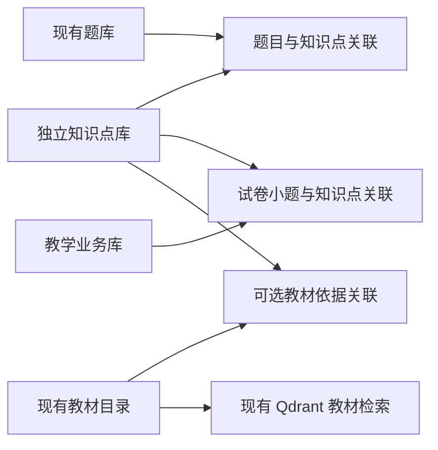
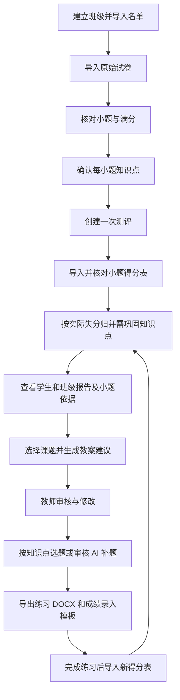

# 智启课源：学情分析、知识点题库与 AI 备课数据库设计

<!-- G5:20261005 -->
2026-10-05T15:21:15.335336+08:00：[G5证据](../../qa/TEACHING-LOOP-G5-20261005/README.md)。

2026-10-05 G5两项P2已独立限定技术关闭：R-G4-RECOVERY-01清缓存只采用本次操作/会话/明确结果，失败保持当前稿件且不误开历史成功文档；R-B7A-QUALITY-01严格核CSV形状与空人审、固定MD完整空槽，合法SHA不代替内容判据。G5-CLOSE-v1与两finding收据已生成，独立V00签收并STOP；这是本次修复批G5，不等于原v2整体交付G5，不关闭原B6/B7整体。

必要新完整check126文件1380单测/typecheck/lint0/build；独立最终152/152；CLI102为5正常97正确硬拒，四guard实际0；新实际页面8和现行29spec174各单轮完整通过，0skip/retry/flaky/reporterErrors，174含原21UI/R14和6既有隔离真实FastAPI场景（2fixture），模型0，不称全mock。单独pytest API、聊天专项及导出本批未执行，backend410/chat186/exportCore11逐SHA历史绑定；59历史引用精确+1旧MISSING_NOT_RUN，旧export43有12漂移不能整域转签。

当前CANDIDATE-G5-built-r2 SHA049ad4057540ba1e2bd6f383c3944bba738ff2e47acd2d1dde542d210506c533：960source/3660执行QA/33contract/970build，构建2Gg_WxijBmV9IGIkY1vmG、实际proxy8001、next-env原字节恢复。152实际跑r2；check实际prebuild-r2，102/8/174实际built-r1。两非其执行闭包QA差异与同源码/契约/整构建转签单列，保留原实际候选身份，不冒称r2重跑；组件首轮150/152两QA入口首败及最终新完整152分别保留，无拼轮。文件数不是测试数。

六当前权威文档只新增本批G5状态块，完整开工内容含原v2任务/伪代码/旧审查保持原字节；原Word/Guide/API/ROUTES/PLAN、旧QA22207、原材料1056及原273引用保持。当前文档与最后独立文档审查、封印单列后验收据，不声称产品候选覆盖后加文档。ROOT自有四原实例及捕获26后代收据闭合，5174/8001无监听，2fixture child/logClosed；所有TEMP/首败保留，未知用户进程未动。

本批在最终文档独立收据及封印完成后STOP，下一动作只等用户新明确指示。B7-B/live未开始、教师pending、Word/WPS原生not_run、旧物理SQLite/Blob恢复源TEMP缺件not_run_source_temp_unavailable；canonical来源绑定不代替物理通过，历史13PDF页不代替原生页核。RAG-REL/R14跨批间歇/CV01～03/OBS-LP-MODE-LABEL及原环境观察保持OPEN。旧被拒额外HTTP身份probe未重试；无正式数据/6333/迁移/压力，无Git提交/推送/切分支/部署，没有自动下一批或重制离线包。真实试评交接仅列未来授权输入，executorPresent=false/budgetEnforced=false。
<!-- /G5:20261005 -->

<!-- G4-B7A-REVIEW:20261005 -->
2026-10-05：[本轮代码审查](../../qa/TEACHING-LOOP-G4-B7A-REVIEW-20261005/REVIEW.md)新增两项P2；[G5总控提示词](G5_总控启动提示词_20261005.md)限定本次回执归属与CSV/Markdown空人审验证，尚未启动。此修复批G5不等于原计划整体交付门禁；原v2任务与伪代码完整保留，原G4关闭及B7-A正常材料事实保持。唯一当前状态见[CURRENT_STATUS](../../CURRENT_STATUS.md)。
<!-- /G4-B7A-REVIEW:20261005 -->

<!-- G4-B7A:20261005 -->
2026-10-05T14:02:43.529062+08:00：[本批证据](../../qa/TEACHING-LOOP-G4-B7A-20261005/README.md)。

2026-10-05本批交付：G4四项已独立限定技术关闭；随后B7-A离线工具与验收准备完成。G4-CLOSE-v1.json与四项收据保持原件；本轮只完成离线，不关闭原B6/B7整体。

G4实际完整check125文件1354单测/typecheck/lint0/build通过；独立组件38、质量工具59预期结果、新真实浏览器11、原真实14、现行29spec174 E2E分别完整单轮通过，0skip/retry/flaky/reporterErrors。构建VeOLFBYrp-8v24Yjm-HFi，实际代理8001，next-env原字节恢复。B7仅新增离线Python入口/专属测试/README，前端、后端、旧三工具、契约与构建逐项未变；精确引用上述G4门禁及适用历史同源证据，不冒称再次跑完整API/聊天/恢复或重新导出。

B7-A已先交需求→固定样本→结构→真实输出→教师理由→排版矩阵，再实施工具。最终作者21/21完整通过；独立46/46完整首次CLI轮通过（15全集、明确14子集+C15未运行，以及44项硬拒），全部网络/app/.env/数据库打开guard尝试0，各子进程和日志关闭。原作者首败、准备定位/封印失败、候选r1/r2与所有TEMP保留，不拼轮或改原业务判据。B7A-OFFLINE-ACCEPT-v1.json、v00/b7a/RESULT-v1.md、B7A-OFFLINE-MATERIALS-v1.md和本批README为收据/材料入口。

正常材料包b7a/prepared-full-v1仅生产一次，273条固定SHA引用；原15案例/15逐例DOCX、四代表DOCX/四旧实际PDF/13旧PNG、八维rubric和原15行空feedback保持。新native逐页表只有四文件起始行，实际原生页码/页数、应用/版本、评审者、证据理由与结论留空；13页PDF只作历史参考，不能代替原生页数或教师评价。

最终冻结CANDIDATE-B7A-offline-r2.json SHA3a73dd766c2e23e57e5726e157f7ef5ef1efe9a7c5f815429b3774ca24568297：source959/执行QA3496/契约33/build970；历史QA19169逐项不变。原v2计划书87340字节完整保留，仅增加本批状态；CURRENT_STATUS/NEXT_SESSION及现行索引原内容同样保留，PROJECT_GUIDE/API/ROUTES不变，main@b7f99ab未改。自有服务、浏览器后代/工具子进程与句柄关闭，5174/8001无监听；不停止用户进程，不删TEMP或旧policy拒删目录。

live=not_run_user_offline_scope，teacher_review_pending，Word/WPS=not_run_pending_human_manual_open。旧物理SQLite/Blob与恢复证明缺失、唯一旧VISUAL-REVIEW引用缺件均单列not_run；冻结canonical来源绑定不冒称新物理通过。旧export/styles43中12项历史漂移不转移整体排版证明；R14跨批间歇、CV01～03、OBS-LP-MODE-LABEL、RAG-REL及原环境观察保持OPEN。正式Qdrant/迁移、额外压力、正式数据/6333、发布部署未执行。

本批到此STOP。下一动作仅按教师后续反馈或用户新的明确范围执行；没有真实模型授权/执行器或自动下一批，不Git写入/推送/切分支/部署。后续接续从本批收据与待验边界开始，原任务和伪代码不改。
<!-- /G4-B7A:20261005 -->

2026-10-04，最新实施材料：[限定B6后续审查](../../qa/TEACHING-LOOP-B6-REVIEW-20261004/REVIEW.md)、[G4→B7-A提示词](B7_总控启动提示词_20261004.md)。原G3/限定B6已关闭；两项沿用产品与两项工具缺口待修，再接有限试评，当前仅审查/提示词。原v2任务与伪代码不改，不将目标表图当当前状态；唯一进度见[CURRENT_STATUS](../../CURRENT_STATUS.md)。以下历史块保留原时点。

<!-- B6-FINAL-INDEX:20261004 -->
2026-10-04T15:35:08.675530+08:00：G3独立技术关闭；本批限定B6技术集成与教学质量验收准备已完成，见[最终矩阵](../../qa/TEACHING-LOOP-G3-B6-20261004/B6-CLOSE-MATRIX-v1.md)、[收据](../../qa/TEACHING-LOOP-G3-B6-20261004/B6-CLOSE-v1.json)、[教师试用](../../qa/TEACHING-LOOP-G3-B6-20261004/b6-exports/TEACHER-TRIAL-v1.md)。1286/check、真实五字段、四视口14、原完整153及独立技术签收完成；最终文档后验单列；真实模型待输入、教师评价待验、Word/WPS排版not_run、RAG-REL OPEN，原B6/B7整体未关闭。以下开工和10-03文字保留历史时点；唯一当前入口仍为[CURRENT_STATUS](../../CURRENT_STATUS.md)。本批停止，无Git或部署。
<!-- /B6-FINAL-INDEX:20261004 -->

<!-- B6-CHECKPOINT:20261004-RELEASED -->
2026-10-04T13:58:43.711694+08:00：G3已独立技术关闭；B6先行需求→实现→原证据→剩余矩阵已形成，三路任务已释放，当前新完整教学链/≥12匿名质量准备/四类导出试用材料进行中。ROOT新隔离8001/PID4056和既有5174/PID21544均回环自有，真实业务沿用现有模块/Transport替身；无真实模型调用。恢复来源v2精确分列原样本16库审计与最终410同源API恢复用例，未本批重跑恢复。live_run待输入、teacher_review_pending、Word/WPS人工排版待验、原B7未关闭。
<!-- /B6-CHECKPOINT:20261004-RELEASED -->

2026-10-04 当前已授权先G3修复B5F-R01/R02，再做限定B6剩余集成与质量验收准备，见[本批](../../qa/TEACHING-LOOP-G3-B6-20261004/README.md)和[唯一状态](../../CURRENT_STATUS.md)。G3尚未关闭，B6未启动；v2原任务与伪代码保持，仅追加状态。

设计版本：v1.0；日期：2026-09-30。本文档包是功能与数据库设计规格，不代表这些模块已经实现。当前项目能力与实施进度以 `docs/CURRENT_STATUS.md` 为准。原始计划书只作为参考，本轮用户的明确意见优先。

当前能力与待验问题先读 [CURRENT_STATUS](../../CURRENT_STATUS.md)。原G3及限定B6已技术/准备关闭，最新[后续审查](../../qa/TEACHING-LOOP-B6-REVIEW-20261004/REVIEW.md)新增四项待G4；[G4→B7-A提示词](B7_总控启动提示词_20261004.md)规定先修两产品/两工具缺口，再有限试评接入。学情/练习/教案及15匿名案例已有交付，不重复建设；原B6/B7整体与真人/live/WPS依实际待验。本文表/图仍为目标规格，设计中的‘待建设’不自动等于今日状态。

实施与派发入口（v2.0）：[多 Agent 实施任务计划书](多Agent实施任务计划书_v2.0.md)、[总控/实现/验收启动提示词](多Agent启动提示词_v2.0.md)。用户已改为一人调度多个 Agent，原八人任务下发包保留作历史参考。计划中的导入批次、任务和修订结构以 09-30 原核查基线设计，B0–B3 已实现其中部分；以实际迁移与 CURRENT_STATUS 核对剩余增量，不能将原参考 SQL 当作已应用结构或重复建库指令。

## 1. 已确定的需求

1. 教师提供学生名单、原始试卷 DOCX、每位学生的每小题得分表。系统解析小题，建议其知识点，由教师确认后建立关联。
2. **任意一道关联小题实际得分低于该小题满分，就把关联知识点列入该学生本次测评的“需巩固知识点”。** 本轮用户已选定此规则。
3. 不引入掌握概率预测、知识追踪、加权掌握度或多知识点分值分摊。得分已经由教师或现有成绩系统提供，本系统不改卷、不识别评分点、不自动给学生答案打分。
4. **知识点独立建库，题库通过关联表归类到知识点。** 教材不是题目所属的必经父级；教材可以作为某知识点的证据来源。
5. 基于已确认学情、教材依据和题库资源，AI 提供教案调整及练习建议。教师审核后应用；练习能导出 DOCX，并通过再次导入小题得分形成闭环。

产品中“需巩固”表示本次测评发现相关失分，不能偷偷改成长期能力预测。相关小题全部满分显示“本次相关题均满分”；无有效成绩显示“暂无有效依据”。综合小题关联多个知识点时，同时列出相关知识点，并显示“综合题失分关联，具体错因需教师确认”。

## 2. 阅读入口与交付对应

| 用户要求 | 文件 | 内容 |
|---|---|---|
| 整体架构图 | [00 整体架构图与说明](00-overall-architecture.md) | 五层目标架构、现有/待建设状态、存储职责和教学闭环；附 PNG |
| 实体图 | [01 实体与业务实体图](01-entities.md) | 核心实体定义、概念图和学情、题库、备课局部实体图 |
| 联系定义与完整性约束图 | [02 联系与完整性约束](02-relationships-and-constraints.md) | 基数、可选性、外键、跨库引用、确认闸门、版本保护 |
| 细化功能模块图 | [03 功能模块图](03-function-modules.md) | 模块分解、前后端职责、数据依赖和操作流程 |
| 功能说明文档 | [04 功能说明](04-functional-specification.md) | 输入输出、正常流程、异常、状态机、AI 边界与验收用例 |
| 总实体 ER 图 | [05 总实体 ER 图](05-total-er.md) | 所有新增物理表及现有被引用主体表 |
| 关系模式和数据表设计 | [06 关系模式与数据字典](06-data-design.md) | 字段类型、可空性、默认值、主键、外键、唯一约束、索引和触发器 |
| 建库约束附件 | [SQL 设计目录](sql/) | 知识点库、教学业务库、现有题库增量表及只读现有结构快照 |
| 设计自检 | [07 设计验证记录](07-design-validation.md) | SQL 建表/约束验证、图语法与渲染结果、未执行项目 |

各 `.md` 内嵌 Mermaid 图；图源码另存于 `diagrams/`，渲染后的 SVG 另存于 `diagrams/rendered/`。图不支持预览的编辑器也能直接阅读实体表和联系表。

## 3. 建库方案

| 物理存储 | 职责 | 本次设计动作 |
|---|---|---|
| `.local-data/knowledge/knowledge.sqlite3` | 独立知识点定义、修订、别名、教材关联 | 设计 5 张新表，作为知识点唯一权威 |
| `.local-data/question-bank/question-bank.sqlite3` | 题干、答案、来源、修订、导入与审核 | 复用现有 9 张表；只新增 `question_knowledge_links` |
| `.local-data/teaching/teaching.sqlite3` | 班级、学生、原卷、小题、得分、学情、教案、练习与任务 | 设计 33 张新表，分阶段建设 |
| `.local-data/textbooks/catalog.sqlite3` | 现有教材目录、不可变原文修订、分块和索引代 | 保留；通过受控服务提供教材依据 |
| 本机 Qdrant | 教材向量检索 | 保留；不存学生成绩和题目内容 |
| 受管文件目录 | 名单、成绩原件、原卷、配图、导出文件 | 文件内容与数据库元数据分开，散列校验 |

这里“知识点独立建库”同时指业务上独立管理、物理上使用独立 SQLite 文件。题干继续存于题库文件；在知识点页面点击某知识点，查询关联表得到题目，并不复制一份题干到每个知识点下面。

本目录保留 2026-09-30 的设计规格与参考 SQL；B0–B3 已分批落地四库和部分业务结构。当前后端 AGENTS 已登记四库，正式表结构以追加式迁移为准，不能把本设计 SQL 当作重复建库指令。本次文档整理不执行正式数据库 SQL。

生产连接仍统一经过现有 `app/core/sqlite.py`，保持回环服务、有限 busy timeout、WAL 和外键开启。数据库文件增加不意味着增加后端服务，业务仍由唯一 FastAPI 承担。

## 4. 教师实际操作链路

## 5. 学情规则的具体例子

某试卷有以下已确认关联：

| 小题 | 知识点 | 满分 | 学生 S001 得分 | 本题观察 |
|---|---|---:|---:|---|
| 5 | 函数单调性 | 5 | 3 | 存在 2 分失分 |
| 12(1) | 函数单调性 | 4 | 4 | 满分 |
| 12(2) | 函数最值 | 6 | 空白 | 未录入，不当作零分 |
| 16 | 函数单调性、函数最值 | 10 | 8 | 综合题存在失分 |

结论：函数单调性、函数最值均列入本次“需巩固”，分别展示相关失分小题。函数最值同时显示存在未录入成绩。系统不会把第 16 题的 2 分按知识点分摊，不输出“单调性掌握 60%”或“最值掌握 80%”。

知识点层面同一题可同时成为多个知识点的依据，但学生总分始终从小题成绩事实计算，不能把知识点分组的分数再相加。班级“需巩固人数”按学生去重，多个知识点人数也不能相加后称为班级总人数。

## 6. 版本与历史保护

- 知识点有稳定身份和内容修订，改名称不改身份。
- 正式题目复用现有不可变 `question_revisions`；变更标注时产生新题目修订。
- 原卷确认后，小题、满分、内容与知识点映射固定。修改建立新试卷修订；已施测记录保留旧卷。
- 成绩确认后固定为全量快照。修正形成新成绩修订，不覆写旧成绩。
- 报告冻结成绩版本、名单选择和规则。教案、练习引用固定修订与来源快照。
- 新数据不会自动替换已导出的教案或练习；界面提示依据存在新版本，由教师选择重新生成。

## 7. 实施拆分

| 里程碑 | 范围 | 完成条件 |
|---|---|---|
| M1 数据对齐 | 知识点、题库关联、名单、原卷、小题、知识点确认、成绩导入 | 一份脱敏真实 DOCX 和 XLSX 可完整对齐，异常可见可修正 |
| M2 学情报告 | `any_loss_v1` 归并规则、学生/班级报告、证据展开 | 失分依据可复算，缺考/空白不误判，修订不改变旧报告 |
| M3 练习回流 | 知识点筛题、审核、DOCX、成绩模板、练习转测评 | 练习题号和分数可回传到同一分析流程 |
| M4 AI 备课 | 教材依据、学情摘要、教案建议、临时分组、教师审核 | 每处调整有依据，不覆盖教师编辑，导出可用 |

39 张新增表是完整目标模型，不要求第一批全部启用。M1/M2 不依赖 AI 教案、分组和任务模块；不建设空页面来表示功能已完成。具体排期和实施记录仍归入 `docs/CURRENT_STATUS.md`，本文件不另建进度台账。

## 8. 原则与参考

本设计延续现有题库的“建议—审核—确认”、教材的不可变修订和范围核验。SQLite 外键必须在每个连接开启，复合外键的父键需要匹配的主键或唯一约束；同库数值和不可变约束可使用 CHECK/触发器。依据：[SQLite 外键说明](https://www.sqlite.org/foreignkeys.html)、[SQLite 触发器说明](https://www.sqlite.org/lang_createtrigger.html)。跨库联系的校验与发布闸门见 02，不能用一条虚线冒充数据库已经提供的外键。

项目模式参考：[Moodle 题库版本与状态](https://docs.moodle.org/405/en/mod/quiz/question)、[Ed-Fi 测评结构与学生结果分离](https://docs.ed-fi.org/getting-started/provider-playbook/specifics-by-provider-type/assessment-providers/assessment-providers-playbook/part-ii-how-edfi-assessment-data-works/)、[CASE 稳定知识标识](https://www.1edtech.org/standards/case)。仅借鉴数据组织，本方案不引入它们的整套运行平台。
